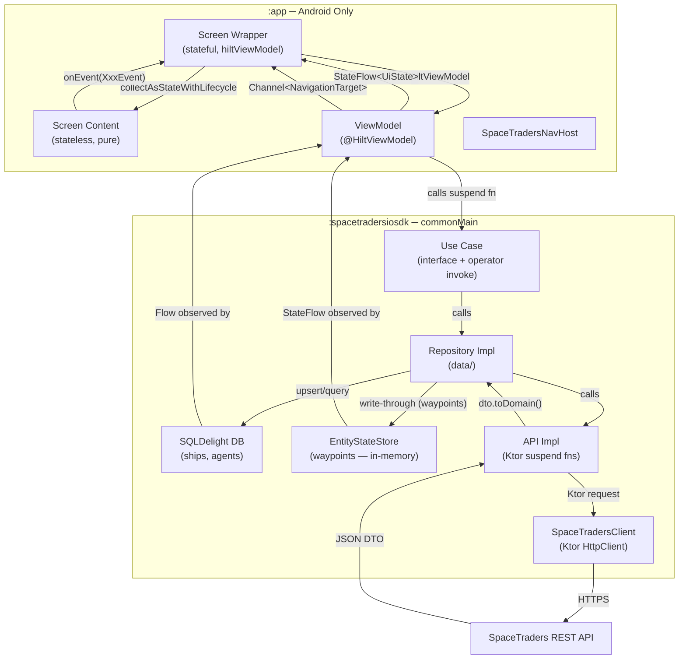

# Architecture Reference: Android/KMP Gold Standard Playbook

> **Purpose:** Personal reference for building modern, scalable Android/KMP apps. Grounded in real decisions made in the SpaceTraders IO project. When starting a new app, read this first.

---

## Table of Contents

1. [High-Level Architecture](#1-high-level-architecture)
2. [UI & State Management (UDF)](#2-ui--state-management-udf)
3. [Routing & Navigation](#3-routing--navigation)
4. [Data & Domain Layer](#4-data--domain-layer)
5. [Networking (Ktor)](#5-networking-ktor)
6. [Dependency Injection (Hilt)](#6-dependency-injection-hilt)
7. [Testing Philosophy](#7-testing-philosophy)

---

## 1. High-Level Architecture

### The Two-Module Split

The project is divided into exactly two Gradle modules, and the boundary between them is a hard architectural contract:

| Module | What it owns | What it must NOT contain |
|---|---|---|
| `:spacetradersiosdk` | Network client, API layer, DTOs, domain models, repository interfaces + impls, use cases, state stores, session management | Any Android/Compose import, any UI concern |
| `:app` | Jetpack Compose screens, ViewModels, Hilt DI module, navigation graph, theme, reusable UI components | Direct Ktor calls, DTO types, any business logic |

**Why this matters:** The SDK compiles for Android *and* iOS (`commonMain`). If any Android-only import leaks into `commonMain`, the iOS build breaks immediately. This hard failure is the enforcement mechanism — the module boundary is not a convention, it is a compiler constraint.

The `:app` module depends on `:spacetradersiosdk`. The SDK has zero knowledge of `:app`. This one-directional dependency means the entire business logic layer can be tested on the JVM without an Android device.

### Data Flow



### The `expect/actual` Mechanism

`Platform.kt` in `commonMain` is the current example. Platform-specific behaviour (e.g., the Ktor HTTP engine — OkHttp on Android, Darwin on iOS) is declared with `expect` in `commonMain` and fulfilled with `actual` in `androidMain`/`iosMain`. Every new platform-specific concern should follow this same pattern rather than reaching for conditional logic in `commonMain`.

---

## 2. UI & State Management (UDF)

### Philosophy

All screens follow **Unidirectional Data Flow (UDF)**:

- **State flows down:** A single `StateFlow<XxxUiState>` is the only source of truth for the UI. The `data class` uses default-value constructor parameters so an "empty" state is always valid.
- **Events flow up:** The user's interactions are expressed as a `sealed interface XxxEvent`. The ViewModel's single `onEvent(event: XxxEvent)` function handles all of them.
- **Navigation is fire-and-forget:** One-shot navigation signals use `Channel<NavigationTarget>(Channel.BUFFERED)`, not `SharedFlow`. SharedFlow re-delivers the last event to new collectors — a subscriber arriving after a config change would immediately navigate again. A `Channel` element is consumed exactly once.

### UiState + Event Pair

```kotlin
// Every field has a safe default. The ViewModel can always construct one without arguments.
data class FooUiState(
    val items: List<Foo> = emptyList(),
    val isLoading: Boolean = false,
    val error: String? = null
)

sealed interface FooEvent {
    data object RefreshClicked : FooEvent
    data class ItemSelected(val id: String) : FooEvent
    data object ErrorDismissed : FooEvent
    // Navigation events live here too, even if the VM just passes them through:
    // data class ViewDetailClicked(val id: String) : FooEvent
}
```

### ViewModel — Simple Pattern (MutableStateFlow)

Use this when the screen's state is self-contained.

```kotlin
@HiltViewModel
class FooViewModel @Inject constructor(
    private val doFooUseCase: DoFooUseCase
) : ViewModel() {

    private val _uiState = MutableStateFlow(FooUiState())
    val uiState: StateFlow<FooUiState> = _uiState.asStateFlow()

    private val _navEvent = Channel<NavigationTarget>(Channel.BUFFERED)
    val navEvent = _navEvent.receiveAsFlow()

    fun onEvent(event: FooEvent) {
        when (event) {
            is FooEvent.ItemSelected -> viewModelScope.launch { handleItemSelected(event.id) }
            is FooEvent.RefreshClicked -> viewModelScope.launch { refresh() }
            is FooEvent.ErrorDismissed -> _uiState.update { it.copy(error = null) }
        }
    }

    private suspend fun handleItemSelected(id: String) {
        _uiState.update { it.copy(isLoading = true, error = null) }
        try {
            doFooUseCase(id)
            _navEvent.send(NavigationTarget.FooDetail(id))
        } catch (e: SpaceTradersApiException) {
            _uiState.update { it.copy(isLoading = false, error = e.message) }
        }
    }

    private suspend fun refresh() { /* ... */ }
}
```

### ViewModel — Derived State Pattern (combine)

Use this when state is composed from multiple reactive sources (e.g., a repository `Flow` from SQLDelight plus local loading/error signals).

```kotlin
@HiltViewModel
class BarViewModel @Inject constructor(
    private val fooRepository: FooRepository
) : ViewModel() {

    private val _isLoading = MutableStateFlow(false)
    private val _error = MutableStateFlow<String?>(null)

    // combine merges multiple flows into one derived StateFlow.
    // fooRepository.observeFoos() is backed by SQLDelight — it emits automatically
    // whenever the DB changes (no manual notify needed).
    val uiState: StateFlow<BarUiState> = combine(
        fooRepository.observeFoos(),
        _isLoading,
        _error
    ) { foos, isLoading, error ->
        BarUiState(items = foos, isLoading = isLoading, error = error)
    }.stateIn(
        scope = viewModelScope,
        started = SharingStarted.Eagerly,  // see Gotcha below
        initialValue = BarUiState()
    )

    private val _navEvent = Channel<NavigationTarget>(Channel.BUFFERED)
    val navEvent = _navEvent.receiveAsFlow()

    init {
        // Always refresh on init — DB may be empty or stale.
        // The Flow in combine() will emit automatically once the DB is written.
        viewModelScope.launch { loadFoos() }
    }

    private suspend fun loadFoos() {
        _isLoading.value = true
        _error.value = null
        try {
            fooRepository.refreshFoos()
        } catch (e: Exception) {
            _error.value = e.message
        } finally {
            _isLoading.value = false
        }
    }

    fun onEvent(event: BarEvent) {
        when (event) {
            is BarEvent.RefreshClicked -> viewModelScope.launch { loadFoos() }
        }
    }
}
```

> ⚠️ **Gotcha — `SharingStarted.WhileSubscribed` + `StandardTestDispatcher`:**
> `WhileSubscribed(5000)` keeps the flow alive 5 seconds after the last collector disappears, which is great for production (avoids recomputing on quick back-navigations). But in unit tests with `StandardTestDispatcher`, there is no active subscriber when you read `.value` directly — the upstream `combine` never fires and `.value` stays at its initial value. Use `SharingStarted.Eagerly` in ViewModels when tests need to read `.value` directly.

> ⚠️ **Gotcha — `combine` + single `_localState.update()` timing in tests:**
> Even with `SharingStarted.Eagerly`, a `_localState.update { }` call schedules a re-emission through `combine` on the test dispatcher — it does NOT execute synchronously. Reading `uiState.value` immediately after `onEvent()` (without `advanceUntilIdle()`) returns the stale value. Always call `testDispatcher.scheduler.advanceUntilIdle()` after each state-changing event before asserting on `uiState.value`. There is one subtle exception: two *consecutive* state updates before an advance coalesce into a single emission — only the final state propagates. This means a test that fires two back-to-back events (e.g., `PurchaseShipClicked` then `PurchaseDismissed`) and then asserts `pendingPurchase == null` will pass even without an intermediate advance, because the combine only ever sees the final null state.

### LocalState Private Data Class Pattern

When a ViewModel has several transient local signals (a refreshing flag, error message, a pending dialog object, an in-progress flag), grouping them into a single private `data class LocalState(...)` is cleaner than maintaining separate `MutableStateFlow<Boolean>`, `MutableStateFlow<String?>`, etc. One `MutableStateFlow<LocalState>` replaces N flows:

- The `combine()` call only needs two arguments: the repository flow and `_localState`.
- `_localState.update { it.copy(...) }` atomically updates multiple fields in a single emission.
- `LocalState` is a private implementation detail — callers never see it.

```kotlin
@HiltViewModel
class ShipyardViewModel @Inject constructor(
    savedStateHandle: SavedStateHandle,
    private val shipyardRepository: ShipyardRepository
) : ViewModel() {

    private val waypointSymbol: String = checkNotNull(savedStateHandle["waypointSymbol"])

    // One flow for all local-only state instead of separate isRefreshing, error, etc. flows
    private val _localState = MutableStateFlow(LocalState())

    val uiState: StateFlow<ShipyardUiState> = combine(
        shipyardRepository.observeShipyard(waypointSymbol),
        _localState
    ) { shipyard, local ->
        ShipyardUiState(
            shipyard = shipyard,
            isRefreshing = local.isRefreshing,
            isPurchasing = local.isPurchasing,
            pendingPurchase = local.pendingPurchase,
            error = local.error
        )
    }.stateIn(viewModelScope, SharingStarted.Eagerly, ShipyardUiState())

    private data class LocalState(
        val isRefreshing: Boolean = true,
        val isPurchasing: Boolean = false,
        val pendingPurchase: ShipyardShip? = null,
        val error: String? = null
    )
}
```

Use the simple `MutableStateFlow` pattern when state is self-contained in the ViewModel. Use the `LocalState` + `combine` pattern when state is derived from a repository `Flow` plus local signals.

### Non-Fatal Secondary Enrichment (`runCatching`)

Some screens need supplementary data that is *nice to have* but should not block the primary content if it fails. The pattern is `runCatching { }` inside a `viewModelScope.launch { }` block, after the primary load succeeds:

```kotlin
private fun loadShip() {
    _localState.update { it.copy(isLoading = true) }
    viewModelScope.launch {
        try {
            fleetRepository.refreshMyShip(shipSymbol)
            val ship = fleetRepository.observeShip(shipSymbol).first()
            if (ship != null) {
                // Non-fatal: if this fails, hasShipyard stays false and the screen still works.
                runCatching {
                    val waypoint = systemRepository.getWaypoint(ship.nav.systemSymbol, ship.nav.waypointSymbol)
                    _localState.update {
                        it.copy(hasShipyard = waypoint.traits.any { t -> t.symbol == WaypointTraitSymbol.SHIPYARD })
                    }
                }
            }
            _localState.update { it.copy(isLoading = false) }
        } catch (e: Exception) {
            _localState.update { it.copy(isLoading = false, error = e.message) }
        }
    }
}
```

The outer `try/catch` is fatal — a failure there means the primary data could not load. The inner `runCatching` is non-fatal — a failure leaves the derived flag at its safe default (`false`) and does not propagate to the error state. This pattern avoids a two-step loading UI while still making the enrichment best-effort.

### Two-Layer Screen Pattern

Every screen is two composables:

```kotlin
// ── Layer 1: Stateful Wrapper ──────────────────────────────────────────────
// Responsible for: injecting ViewModel, collecting navigation events.
// Never contains UI layout code.
@Composable
fun FooScreen(
    onNavigateToDetail: (String) -> Unit,
    onNavigateBack: () -> Unit,
    viewModel: FooViewModel = hiltViewModel()
) {
    val uiState by viewModel.uiState.collectAsStateWithLifecycle()

    LaunchedEffect(Unit) {
        viewModel.navEvent.collect { target ->
            when (target) {
                is NavigationTarget.FooDetail -> onNavigateToDetail(target.id)
                NavigationTarget.Back -> onNavigateBack()
                else -> Unit  // exhaustiveness: sealed when requires all branches
            }
        }
    }

    FooScreenContent(uiState = uiState, onEvent = viewModel::onEvent)
}

// ── Layer 2: Stateless Content ─────────────────────────────────────────────
// Responsible for: layout. Pure function of (state, event emitter).
// Can be used in @Preview and tested independently.
@Composable
fun FooScreenContent(
    uiState: FooUiState,
    onEvent: (FooEvent) -> Unit
) {
    Column {
        if (uiState.isLoading) LinearProgressIndicator()
        uiState.error?.let { error ->
            Text(error)
            Button(onClick = { onEvent(FooEvent.ErrorDismissed) }) { Text("Dismiss") }
        }
        LazyColumn {
            items(uiState.items) { item ->
                Text(item.name, modifier = Modifier.clickable {
                    onEvent(FooEvent.ItemSelected(item.id))
                })
            }
        }
    }
}
```

**Why two layers?** The stateless content composable can be tested with pure function calls and used in `@Preview` without a ViewModel. The stateful wrapper's single responsibility is bridging the ViewModel lifecycle to the composition lifecycle.

---

## 3. Routing & Navigation

### Two Navigation Concepts

This architecture uses two distinct navigation types that serve different masters:

| Type | Lives in | Purpose |
|---|---|---|
| `@Serializable` Route objects | `navigation/Routes.kt` | NavController-facing — represents a destination in the back stack |
| `NavigationTarget` sealed interface | `navigation/NavigationTarget.kt` | ViewModel-facing — a one-shot signal saying "I want to go somewhere" |

**Why the split?** A ViewModel should not know what `NavController` looks like. It emits a `NavigationTarget.FooDetail(id)`. The screen's `LaunchedEffect` translates that into `navController.navigate(FooDetailRoute(id))`. This keeps the ViewModel testable without a NavController dependency.

### Route Objects

```kotlin
// navigation/Routes.kt
// Objects for screens with no parameters; data classes for parameterized screens.
@Serializable object AuthRoute
@Serializable object DashboardRoute
@Serializable data class FooDetailRoute(val id: String)
@Serializable data class SystemMapRoute(
    val systemSymbol: String,
    val focusWaypointSymbol: String? = null  // optional params use nullable defaults
)
```

### NavigationTarget

```kotlin
// navigation/NavigationTarget.kt
sealed interface NavigationTarget {
    data object Auth : NavigationTarget
    data object Dashboard : NavigationTarget
    data class FooDetail(val id: String) : NavigationTarget
    data object Back : NavigationTarget
}
```

### NavHost (with Auth Gate Pattern)

```kotlin
@Composable
fun AppNavHost(
    tokenRepository: TokenRepository,  // injected by MainActivity, not hiltViewModel
    modifier: Modifier = Modifier
) {
    val navController = rememberNavController()

    // Auth gate: determined once at composition, not recomputed on every recomposition
    val startDestination: Any = if (tokenRepository.hasToken()) DashboardRoute else AuthRoute

    NavHost(
        navController = navController,
        startDestination = startDestination,
        modifier = modifier
    ) {
        composable<AuthRoute> {
            AuthScreen(
                onNavigateToDashboard = {
                    navController.navigate(DashboardRoute) {
                        // Clear AuthRoute from back stack so Back doesn't return to login
                        popUpTo<AuthRoute> { inclusive = true }
                    }
                }
            )
        }

        composable<DashboardRoute> {
            DashboardScreen(
                onNavigateToFooDetail = { id -> navController.navigate(FooDetailRoute(id)) },
                onLogout = {
                    navController.navigate(AuthRoute) {
                        // Clear the entire back stack on logout
                        popUpTo(0) { inclusive = true }
                    }
                }
            )
        }

        composable<FooDetailRoute> {
            FooDetailScreen(onNavigateBack = { navController.popBackStack() })
        }
    }
}
```

**Rules:**
- Screens receive navigation callbacks as lambdas — they never hold a `NavController` reference.
- `popUpTo { inclusive = true }` prevents the back button from returning to a screen that should no longer be reachable (e.g., the auth screen after login, or authenticated screens after logout).
- `startDestination` is evaluated once, at `NavHost` composition. It is not reactive — to handle mid-session auth state changes, emit a `NavigationTarget` from the ViewModel instead.

---

## 4. Data & Domain Layer

### Clean Architecture Flow

```
REST API → DTO (api/dto/) → Mapper (api/mapper/) → Domain Model (domain/model/)
                                                           ↓
                                              Repository Interface (domain/repository/)
                                                           ↓
                                              Repository Impl (data/repository/)
                                              [ships/agents: upsert to SQLDelight DB]
                                              [waypoints: write to WaypointStateStore]
                                                           ↓
                                              Use Case (domain/usecase/)
                                                           ↓
                                              ViewModel (:app) ← observes Flow from repo
```

**The invariant:** Domain models have zero `@Serializable` or Ktor imports. DTOs have zero domain model imports. The mapper is the only place these two worlds touch.

**Two persistence paths:**
- **Ships + agents** use SQLDelight as the single source of truth. Repository impls write via `database.shipQueries.upsertShip(...)` and expose `Flow<List<Ship>>` / `Flow<Ship?>` via `asFlow().mapToList/mapToOneOrNull(Dispatchers.Default)`. ViewModels combine these Flows with local loading/error signals.
- **Waypoints** remain in-memory (`WaypointStateStore`, an `EntityStateStore<String, Waypoint>`). They are session-scoped, do not need to survive process death, and benefit from the simpler in-memory pattern.

### Fog-of-War with Nullable Lists

Some API resources have a **fog-of-war** behaviour: the server returns metadata for a location even when no ship is present, but withholds the detail list unless a ship is docked or in orbit there. The shipyard is the canonical example — `GET /systems/:system/waypoints/:waypoint/shipyard` always returns the waypoint's `symbol` and `modificationsFee`, but only includes the `ships` array when a player's ship is physically there.

**The problem with SQL:** A relational table cannot distinguish between "this row exists but the list is empty" and "the list was never fetched." An absent row means *not cached at all*; a row with zero child rows means *cached and empty*. There is no native way to express "cached, but the detail was fog-of-war."

**The solution — sentinel column:** Add a `ships_cached INTEGER NOT NULL DEFAULT 0` column to the parent table. `0` = fog-of-war (the API returned metadata but omitted the detail list); `1` = the list was present in the last response (even if it was empty). The schema:

```sql
-- Shipyard.sq
CREATE TABLE shipyard (
    symbol            TEXT    NOT NULL PRIMARY KEY,
    modifications_fee INTEGER NOT NULL,
    ships_cached      INTEGER NOT NULL DEFAULT 0   -- 0 = fog-of-war, 1 = detail fetched
);

upsertWithShips:
INSERT OR REPLACE INTO shipyard(symbol, modifications_fee, ships_cached)
VALUES (:symbol, :modifications_fee, :ships_cached);
```

The repository then uses the sentinel to decide whether to pass `null` or the child rows to the domain mapper:

```kotlin
// data/repository/ShipyardRepositoryImpl.kt
override fun observeShipyard(waypointSymbol: String): Flow<Shipyard?> =
    combine(
        database.shipyardQueries.selectBySymbol(waypointSymbol)
            .asFlow().mapToOneOrNull(Dispatchers.Default),
        database.shipyardShipQueries.selectByWaypoint(waypointSymbol)
            .asFlow().mapToList(Dispatchers.Default)
    ) { meta, ships ->
        // null meta → nothing cached yet (caller decides how to handle)
        // meta.ships_cached == 0 → fog-of-war: pass null as the ships list
        // meta.ships_cached == 1 → detail present: pass the child rows
        meta?.toDomain(if (meta.ships_cached == 1L) ships.map { it.toDomain() } else null)
    }

override suspend fun refreshShipyard(systemSymbol: String, waypointSymbol: String) {
    val dto = shipyardApi.getShipyard(systemSymbol, waypointSymbol)
    database.transaction {
        database.shipyardQueries.upsertWithShips(
            symbol = dto.symbol,
            modifications_fee = dto.modificationsFee.toLong(),
            ships_cached = if (dto.ships != null) 1L else 0L
        )
        // Only touch the child table when the detail was actually returned.
        // Leaving old rows in place during fog-of-war preserves the last-known listings.
        if (dto.ships != null) {
            database.shipyardShipQueries.deleteByWaypoint(waypointSymbol)
            dto.ships.forEach { ship ->
                database.shipyardShipQueries.upsert(waypoint_symbol = waypointSymbol, ship = ship.toDomain())
            }
        }
    }
}
```

The domain model reflects this contract explicitly:

```kotlin
data class Shipyard(
    val symbol: String,
    val modificationsFee: Int,
    val ships: List<ShipyardShip>?   // null = fog-of-war; emptyList() = present, none for sale
)
```

The UI then renders three distinct states: loading spinner (no metadata yet), amber "ship must be present" warning (fog-of-war, `ships == null`), and the actual listings (`ships != null`). The three-state domain model drives the three-branch `when` in the screen composable without any extra flags.

### DTO + Mapper + Domain Model

```kotlin
// api/dto/FooDto.kt  — mirrors the API schema exactly
@Serializable
data class FooDto(
    val id: String,
    val name: String,
    val count: Int,
    val optionalField: String? = null   // nullable + default for fields the API may omit
)

// api/mapper/FooMapper.kt  — extension function, never a method on the DTO or domain model
fun FooDto.toDomain(): Foo = Foo(
    id = id,
    name = name,
    count = count,
    optionalField = optionalField
)

// domain/model/Foo.kt  — clean data class, no annotations
data class Foo(
    val id: String,
    val name: String,
    val count: Int,
    val optionalField: String?
)
```

### Repository Interface + Implementation

```kotlin
// domain/repository/FooRepository.kt
interface FooRepository {
    suspend fun getFoos(page: Int = 1, limit: Int = 20): List<Foo>
    suspend fun getFoo(id: String): Foo
    suspend fun refreshFoos()
}

// data/repository/ShipRepositoryImpl.kt  — SQLDelight-backed example
class ShipRepositoryImpl(
    private val shipApi: ShipApi,
    private val database: SpaceTradersDatabase,
    private val refreshScheduler: RefreshScheduler
) : ShipRepository {

    // Observation: SQLDelight generates a Flow that emits automatically on any DB write.
    // Dispatchers.Default is used (not Dispatchers.IO) — iOS has no IO dispatcher.
    override fun observeShips(): Flow<List<Ship>> =
        database.shipQueries.selectAll()
            .asFlow()
            .mapToList(Dispatchers.Default)
            .map { rows -> rows.map { it.toDomain() } }

    override fun observeShip(symbol: String): Flow<Ship?> =
        database.shipQueries.selectBySymbol(symbol)
            .asFlow()
            .mapToOneOrNull(Dispatchers.Default)
            .map { it?.toDomain() }

    override suspend fun refreshMyShips(page: Int, limit: Int) {
        val ships = shipApi.getMyShips(page, limit).data.map { it.toDomain() }
        // Upsert: insert or replace by primary key. No manual "is empty?" guard.
        ships.forEach { database.shipQueries.upsertShip(it.toEntity()) }
        ships.forEach { scheduleTransitTimerIfNeeded(it) }
    }

    override suspend fun saveShip(ship: Ship) {
        database.shipQueries.upsertShip(ship.toEntity())
    }

    override suspend fun updateShipNav(symbol: String, nav: ShipNav) {
        database.shipQueries.updateNav(/* nav fields mapped to columns */)
    }

    override suspend fun clearAll() { database.shipQueries.deleteAllShips() }

    private fun scheduleTransitTimerIfNeeded(ship: Ship) {
        if (ship.nav.status == ShipNavStatus.IN_TRANSIT) {
            refreshScheduler.schedule(
                id = "ship:${ship.symbol}",   // idempotent — re-scheduling replaces entry
                expiresAt = ship.nav.route.arrivalTime,
                action = { refreshMyShip(ship.symbol) }
            )
        }
    }
}
```

**Key rule:** The repository is the **only writer** to the DB and state stores. ViewModels observe via `Flow` — they are read-only. This ensures any update (user action, timer, initial fetch) flows through the same write path and notifies all observers automatically.

### Use Case Interface + Implementation

Use cases justify their existence by encapsulating **business orchestration** that spans more than one call, enforces pre-conditions, or composes other use cases. A use case that simply delegates a single call to a repository with no logic should be skipped — call the repository directly.

```kotlin
// domain/usecase/NavigateFooUseCase.kt
interface NavigateFooUseCase {
    // operator fun invoke makes the use case callable as: useCase(id, destination)
    suspend operator fun invoke(id: String, destination: String): NavigationResult
}

class NavigateFooUseCaseImpl(
    private val fooApi: FooApi,
    private val fooRepository: FooRepository,
    private val prepareUseCase: PrepareFooUseCase   // use cases can compose other use cases
) : NavigateFooUseCase {

    override suspend operator fun invoke(id: String, destination: String): NavigationResult {
        // Pre-condition: ensure foo is in the correct state before navigating.
        // Read current state from the repository (DB-backed Flow snapshot via first()).
        val current = fooRepository.observeFoo(id).first()
        if (current?.status == FooStatus.DOCKED) {
            prepareUseCase(id)  // operator invoke — called like a function
        }

        // Execute the primary action
        val result = fooApi.navigate(id, destination).toDomain()

        // Write the response back through the repository — this triggers the DB Flow
        // and automatically propagates to all observing ViewModels.
        fooRepository.updateFooNav(id, result.newNav)

        return result
    }
}
```

### EntityStateStore — Reactive State Base

```kotlin
// domain/state/EntityStateStore.kt
class EntityStateStore<K, T> {
    private val _entities = MutableStateFlow<Map<K, T>>(emptyMap())
    val entities: StateFlow<Map<K, T>> = _entities.asStateFlow()

    // observe() returns a flow for a single key — use in ViewModels watching one entity
    fun observe(key: K): Flow<T?> = _entities.map { it[key] }.distinctUntilChanged()

    // All mutations use MutableStateFlow.update() for atomic compare-and-set
    fun put(key: K, entity: T) = _entities.update { it + (key to entity) }
    fun putAll(map: Map<K, T>) = _entities.update { it + map }
    fun update(key: K, transform: (T) -> T) = _entities.update { m ->
        m[key]?.let { m + (key to transform(it)) } ?: m
    }
    fun remove(key: K) = _entities.update { it - key }
    fun clear() = _entities.update { emptyMap() }
}

// Domain-specific stores are zero-boilerplate type aliases
class FooStateStore : EntityStateStore<String, Foo>()
class BarStateStore : EntityStateStore<String, Bar>()
```

### Session Lifecycle

The `SpaceTradersSession` groups the `RefreshScheduler`, in-memory state stores (waypoints, contracts), and a reference to the `SpaceTradersDatabase`. It is created on login and destroyed on logout. The DB rows for ships and agents are cleared in `destroy()` so stale data from a previous session never bleeds into the next.

```kotlin
// domain/session/SpaceTradersSession.kt
interface SpaceTradersSession {
    val refreshScheduler: RefreshScheduler
    val contractStateStore: ContractStateStore
    val waypointStateStore: WaypointStateStore
    val database: SpaceTradersDatabase
    val isActive: Boolean
    fun onResume()
    fun destroy()
}

// domain/session/SpaceTradersSessionImpl.kt
class SpaceTradersSessionImpl(
    private val scope: CoroutineScope,
    override val database: SpaceTradersDatabase
) : SpaceTradersSession {
    override val refreshScheduler = RefreshScheduler(scope)
    override val contractStateStore = ContractStateStore()
    override val waypointStateStore = WaypointStateStore()
    override val isActive: Boolean get() = scope.isActive

    override fun onResume() { refreshScheduler.onResume() }   // fire expired timers on foreground

    override fun destroy() {
        scope.cancel()                               // cancels all pending timers
        database.shipQueries.deleteAllShips()        // clear session data from DB
        database.agentQueries.deleteAll()
    }
}

// domain/session/SessionManager.kt (interface)
interface SessionManager {
    fun requireSession(): SpaceTradersSession
    fun login(token: String)
    fun logout()
    fun restoreIfAuthenticated()
}

// domain/session/SessionManagerImpl.kt
class SessionManagerImpl(
    private val tokenRepository: TokenRepository,
    private val database: SpaceTradersDatabase       // singleton — passed in, not created here
) : SessionManager {
    private var _session: SpaceTradersSession? = null

    override fun requireSession(): SpaceTradersSession =
        _session ?: error("No active session. User must be authenticated.")

    override fun login(token: String) {
        tokenRepository.saveToken(token)
        _session = SpaceTradersSessionImpl(
            scope = CoroutineScope(SupervisorJob() + Dispatchers.Default),
            database = database
        )
    }

    override fun logout() {
        _session?.destroy()
        _session = null
        tokenRepository.clearToken()
    }

    override fun restoreIfAuthenticated() {
        if (tokenRepository.hasToken() && _session == null) {
            _session = SpaceTradersSessionImpl(
                scope = CoroutineScope(SupervisorJob() + Dispatchers.Default),
                database = database
            )
        }
    }
}
```

**`SupervisorJob()`** is critical — if one timer's refresh action throws, it does not cancel the entire session's coroutine scope and bring down all other timers.

**Why is `SpaceTradersDatabase` a singleton passed into the session?** The SQLite file lives for the app process lifetime, not the session lifetime. The session's `destroy()` clears the relevant rows but does not close or recreate the DB driver. This is why the `@Singleton` DB is injected into `SessionManagerImpl` via DI, not created inside the session.

### Contract Repository — Two-Table Design + Status Computation

The contract management feature adds two SQLDelight tables (`contract` and `contract_deliver_good`) and introduces a pattern where the domain status is computed in the mapper layer and stored as a plain TEXT column so SQL can filter by tab without doing date arithmetic.

**Why compute status at the mapper, not on every read?**

`ContractStatus` depends on the current time (`Clock.System.now()`). Computing it on every DB observation would mean every Flow emission recalculates all statuses — and results could differ for the same DB row depending on when the subscriber reads. Storing the status as a TEXT column alongside the row instead gives SQL a stable, filterable value. The trade-off is that cached rows can become stale if the clock advances significantly between API calls. This is acceptable because `refreshContracts()` recomputes and re-stores status on every network fetch.

```
ContractDto.toDomain(now: Instant) {
    val status = computeContractStatus(accepted, fulfilled, deadlineToAccept, termsDeadline, now)
    return Contract(..., status = status)
}
```

**Why a separate `contract_deliver_good` table?**

A contract can have multiple deliver-good requirements (`tradeSymbol`, `destinationSymbol`, `unitsRequired`, `unitsFulfilled`). A single `contract` row cannot represent this list — it belongs in a child table keyed by `(contract_id, trade_symbol)`. On every upsert the repository runs a single `database.transaction { }` that upserts the parent row and does `deleteByContractId` + re-inserts all deliver-good rows. This delete-then-reinsert strategy is simpler than a merge and correct because the full list is always returned by the API.

```kotlin
override suspend fun upsertContract(contract: Contract) {
    database.transaction {
        database.contractQueries.upsert(contract)
        database.contractDeliverGoodQueries.deleteByContractId(contract.id)
        contract.terms.deliverGoods.forEach { good ->
            database.contractDeliverGoodQueries.upsert(contract.id, good)
        }
    }
}
```

**`ContractRepository` is `@Singleton`** because it depends only on `ContractsApi` and `SpaceTradersDatabase`, both of which are singletons. This is the same reasoning as `AgentRepository`. Unlike `FleetRepository` (which holds a `RefreshScheduler` that is session-scoped), `ContractRepository` has no session-dependent deps and is safe to scope to the app process.

### ContractsViewModel — QueryKey + flatMapLatest Pattern

The `LocalState` + `combine` pattern from `ShipyardViewModel` works well when you need to re-combine the *same* repository `Flow` with updated local flags. But `ContractsViewModel` has a different need: when the user switches tabs or changes the page size, the underlying SQL query changes (`selectActiveTab` vs `selectHistoryTab`, different `LIMIT`/`OFFSET`). A simple `combine` cannot restart the DB subscription with new parameters.

The solution: extract a `QueryKey` data class containing only the fields that affect the SQL query, map `_localState` through it, add `distinctUntilChanged()`, then use `flatMapLatest` to re-subscribe whenever the key changes:

```kotlin
private data class QueryKey(val tab: ContractTab, val page: Int, val limit: Int)

@OptIn(ExperimentalCoroutinesApi::class)
private val contractsFlow = _localState
    .map { QueryKey(it.selectedTab, it.currentPage, it.limit) }
    .distinctUntilChanged()          // don't restart the DB subscription for isLoading/pendingAccept changes
    .flatMapLatest { key ->
        val offset = ((key.page - 1) * key.limit).toLong()
        contractRepository.observeContracts(key.tab, key.limit.toLong(), offset)
    }

val uiState = combine(contractsFlow, _localState) { contracts, local ->
    ContractsUiState(contracts = contracts, ...)
}.stateIn(viewModelScope, SharingStarted.Eagerly, ContractsUiState())
```

`distinctUntilChanged()` is the critical piece. Without it, every `_localState.update { it.copy(isLoading = true) }` would trigger a `flatMapLatest` restart — cancelling the current DB subscription and re-subscribing with the same query. The key observation is that `_localState` changes for many reasons (loading flag, pending dialog state, action results), but only tab/page/limit changes should restart the DB subscription.

---

## 5. Networking (Ktor)

### SpaceTradersClient

The client is the single point of Ktor configuration. Every API impl receives an instance and calls `client.authenticated` or `client.unauthenticated`.

```kotlin
class SpaceTradersClient(
    private val tokenRepository: TokenRepository,
    // This lambda is the test seam — production code never sets it;
    // tests inject a MockEngine-backed factory here.
    internal val httpClientFactory: ((token: String?) -> HttpClient)? = null
) {
    // ⚠️ These are get properties, NOT val.
    // A val would capture the token at construction time. If a user registers
    // and the token is saved *after* this class is instantiated, val would
    // miss it. A get property rebuilds the client on every access, picking
    // up the freshly saved token without restarting the app.
    val unauthenticated: HttpClient
        get() = httpClientFactory?.invoke(null) ?: buildHttpClient(null)

    val authenticated: HttpClient
        get() = httpClientFactory?.invoke(tokenRepository.getToken())
            ?: buildHttpClient(tokenRepository.getToken())

    fun authenticatedWith(token: String): HttpClient =
        httpClientFactory?.invoke(token) ?: buildHttpClient(token)

    private fun buildHttpClient(token: String?): HttpClient = HttpClient(/* OkHttp on Android, Darwin on iOS */) {
        install(ContentNegotiation) {
            // isLenient + ignoreUnknownKeys: handles API evolution gracefully
            json(Json { ignoreUnknownKeys = true; isLenient = true })
        }

        // HttpCallValidator intercepts BEFORE ContentNegotiation tries to deserialize.
        // This is how we convert HTTP 4xx/5xx into typed domain exceptions.
        install(HttpCallValidator) {
            handleResponseExceptionWithRequest { cause, _ ->
                val httpException = cause as? ClientRequestException ?: return@handleResponseExceptionWithRequest
                val errorBody = httpException.response.body<ErrorResponseDto>()
                throw SpaceTradersApiException(
                    error = errorBody.error.toDomain(),
                    httpStatus = httpException.response.status.value
                )
            }
        }

        defaultRequest {
            url("https://api.spacetraders.io/v2/")
            // ⚠️ This sets Content-Type globally. Any POST endpoint that sends
            // an empty body MUST use setBody("{}") — an empty body with
            // Content-Type: application/json causes a 422 from the API.
            contentType(ContentType.Application.Json)
            if (token != null) headers.append("Authorization", "Bearer $token")
        }

        install(Logging) {
            logger = NapierLogger()
            level = LogLevel.INFO
        }
    }
}
```

### API Interface + Implementation

```kotlin
// api/endpoints/FooApi.kt
interface FooApi {
    suspend fun getFoos(page: Int = 1, limit: Int = 20): PaginatedResponse<FooDto>
    suspend fun getFoo(id: String): FooDto
    suspend fun performAction(id: String): ActionResultDto   // POST, no request body
    suspend fun performActionWithBody(id: String, body: ActionRequestDto): ActionResultDto
}

class FooApiImpl(private val client: SpaceTradersClient) : FooApi {

    override suspend fun getFoos(page: Int, limit: Int): PaginatedResponse<FooDto> =
        client.authenticated.get("foos") {
            parameter("page", page)
            parameter("limit", limit)
        }.body()

    override suspend fun getFoo(id: String): FooDto =
        // Many endpoints wrap the response in { "data": { ... } }
        client.authenticated.get("foos/$id").body<ApiResponse<FooDto>>().data

    // ⚠️ setBody("{}") is mandatory for POST endpoints with no body.
    // The defaultRequest sets Content-Type globally; sending truly empty body
    // with that header causes 422 Unprocessable Entity from the SpaceTraders API.
    override suspend fun performAction(id: String): ActionResultDto =
        client.authenticated.post("foos/$id/action") { setBody("{}") }
            .body<ApiResponse<ActionResultDto>>().data

    override suspend fun performActionWithBody(id: String, body: ActionRequestDto): ActionResultDto =
        client.authenticated.post("foos/$id/action") { setBody(body) }
            .body<ApiResponse<ActionResultDto>>().data
}
```

### Error Handling in ViewModels

```kotlin
viewModelScope.launch {
    _uiState.update { it.copy(isLoading = true, error = null) }
    try {
        val result = fooUseCase(id, param)
        _navEvent.send(NavigationTarget.Success)
    } catch (e: SpaceTradersApiException) {
        val message = when (val err = e.error) {
            is SpaceTradersError.AuthError.InvalidToken -> "Token expired. Please log in again."
            is SpaceTradersError.NavigationError.ShipInTransit -> "Ship is already in transit."
            is SpaceTradersError.ShipOperationError.ShipNotInOrbit -> "Ship must be in orbit first."
            is SpaceTradersError.GeneralError -> err.message ?: "An error occurred."
            else -> "Error ${e.httpStatus}: ${e.error}"
        }
        _uiState.update { it.copy(isLoading = false, error = message) }
    }
}
```

---

## 6. Dependency Injection (Hilt)

### Three Scoping Tiers

```kotlin
@Module
@InstallIn(SingletonComponent::class)
object SdkModule {

    // ─────────────────────────────────────────────────────────────────────────
    // Tier 1: @Singleton — infrastructure that lives for the entire app process
    // ─────────────────────────────────────────────────────────────────────────

    @Provides @Singleton
    fun provideTokenRepository(): TokenRepository =
        TokenRepositoryImpl(Settings())   // Settings() uses SharedPreferences on Android

    @Provides @Singleton
    fun provideSpaceTradersClient(repo: TokenRepository): SpaceTradersClient =
        SpaceTradersClient(repo)

    // SpaceTradersDatabase is a singleton: the SQLite file lives for the app process.
    // SqlDriverFactory uses @ApplicationContext to locate the database file on disk.
    @Provides @Singleton
    fun provideDatabase(@ApplicationContext context: Context): SpaceTradersDatabase =
        SpaceTradersDatabase(SqlDriverFactory(context).create())

    // SessionManager receives the singleton DB — it passes it into each new
    // SpaceTradersSessionImpl but does not own the DB lifecycle.
    @Provides @Singleton
    fun provideSessionManager(repo: TokenRepository, db: SpaceTradersDatabase): SessionManager =
        SessionManagerImpl(repo, db)

    @Provides @Singleton
    fun provideFooApi(client: SpaceTradersClient): FooApi = FooApiImpl(client)

    // AgentRepository is a singleton: it only depends on AgentsApi + SpaceTradersDatabase,
    // both of which are singletons. No session-scoped deps → safe to be @Singleton.
    @Provides @Singleton
    fun provideAgentRepository(api: AgentsApi, db: SpaceTradersDatabase): AgentRepository =
        AgentRepositoryImpl(api, db)

    // ─────────────────────────────────────────────────────────────────────────
    // Tier 2: Unscoped — session-dependent state (delegates to current session)
    //
    // WHY unscoped? These objects belong to the *session*, not the app process.
    // If @Singleton were used here, the store/scheduler would survive logout and
    // serve stale state to the next user. Unscoped means Hilt calls requireSession()
    // on every injection, always returning the current session's instance.
    //
    // WHY is this safe? Authenticated screens are always behind navigation guards.
    // requireSession() only throws if there is no active session — which cannot
    // happen on screens that are only reachable after login.
    // ─────────────────────────────────────────────────────────────────────────

    @Provides
    fun provideWaypointStateStore(sm: SessionManager): WaypointStateStore =
        sm.requireSession().waypointStateStore

    @Provides
    fun provideRefreshScheduler(sm: SessionManager): RefreshScheduler =
        sm.requireSession().refreshScheduler

    // ─────────────────────────────────────────────────────────────────────────
    // Tier 3: Unscoped — repositories and use cases (stateless or session-scoped
    // via their injected dependencies)
    //
    // FleetRepository is unscoped (not @Singleton) because it depends on
    // RefreshScheduler, which is session-scoped (unscoped tier 2).
    // ─────────────────────────────────────────────────────────────────────────

    @Provides
    fun provideFleetRepository(
        api: FleetApi,
        db: SpaceTradersDatabase,
        scheduler: RefreshScheduler
    ): FleetRepository = FleetRepositoryImpl(api, db, scheduler)

    @Provides
    fun provideNavigateFooUseCase(
        api: FooApi,
        repo: FooRepository,
        prepareUseCase: PrepareFooUseCase
    ): NavigateFooUseCase = NavigateFooUseCaseImpl(api, repo, prepareUseCase)
}
```

### Unscoped Transitive Dependencies

A repository should be unscoped not only when it *directly* holds session state, but also when any of its constructor dependencies are themselves unscoped. This is the **transitive dependency rule**: scope propagates upward through the dependency graph.

`ShipyardRepository` is the canonical example. It does not itself hold a `RefreshScheduler` or a `WaypointStateStore`. But it depends on `FleetRepository` and `AgentRepository` — and `FleetRepository` is unscoped because *it* holds a `RefreshScheduler`. Making `ShipyardRepository` a `@Singleton` while its transitive dependencies are unscoped would cause Hilt to inject the session-scoped `FleetRepository` at app-startup time, capture it in the singleton, and then serve that same (now-stale) instance after logout and re-login:

```kotlin
// ✅ Correct — unscoped because FleetRepository and AgentRepository are unscoped
@Provides
fun provideShipyardRepository(
    shipyardApi: ShipyardApi,
    fleetRepository: FleetRepository,    // unscoped (session-scoped)
    agentRepository: AgentRepository,    // @Singleton — AgentRepository is safe to be singleton
    database: SpaceTradersDatabase       // @Singleton
): ShipyardRepository =
    ShipyardRepositoryImpl(shipyardApi, fleetRepository, agentRepository, database)

// ❌ Wrong — would hold a stale FleetRepository after logout
@Provides @Singleton
fun provideShipyardRepository(...): ShipyardRepository = ...
```

**The heuristic:** When adding a new repository, trace its constructor arguments. If any argument is unscoped (session-scoped), the repository itself must be unscoped too. The only safe way to make a repository `@Singleton` is if every transitive dependency is also `@Singleton`.

> ⚠️ **Gotcha — `@Singleton` capturing an unscoped transitive dep:**
> The compiler will not warn about this. Hilt happily injects an unscoped `FleetRepository` into a `@Singleton` `ShipyardRepository` at the moment of first use. The bug surfaces only after the user logs out and back in — the singleton still holds the `RefreshScheduler` from the old session, timers fire against the wrong DB state, and new refreshes are silently lost.

### Application and Activity Setup

```kotlin
// SpaceTradersApplication.kt
@HiltAndroidApp
class SpaceTradersApplication : Application() {
    @Inject lateinit var sessionManager: SessionManager
    @Inject lateinit var appLifecycleObserver: AppLifecycleObserver

    override fun onCreate() {
        super.onCreate()
        sessionManager.restoreIfAuthenticated()
        ProcessLifecycleOwner.get().lifecycle.addObserver(appLifecycleObserver)
    }
}

// MainActivity.kt
@AndroidEntryPoint
class MainActivity : ComponentActivity() {
    @Inject lateinit var tokenRepository: TokenRepository

    override fun onCreate(savedInstanceState: Bundle?) {
        super.onCreate(savedInstanceState)
        setContent {
            AppTheme {
                AppNavHost(tokenRepository = tokenRepository)
            }
        }
    }
}
```

> ⚠️ **Gotcha — `ProcessLifecycleOwner` dependency:**
> Using `ProcessLifecycleOwner.get()` requires adding `androidx-lifecycle-process` to `app/build.gradle.kts`. It is not bundled with `lifecycle-runtime-ktx`. Without it, the class will not be found at runtime.

---

## 7. Testing Philosophy

### Standards

- **100% class, method, line, and branch coverage** for all new code. No exceptions.
- **No mocking frameworks** (no Mockk, no Mockito). Hand-write fakes that implement the same interface.
- **No testing of implementation details** — test public contracts (inputs → outputs, state transitions, events emitted).
- **SDK tests** live in `spacetradersiosdk/src/androidHostTest/` and run on the JVM.
- **App ViewModel tests** live in `app/src/test/` and run on the JVM.

### The MockEngine Pattern

All SDK HTTP tests use Ktor's `MockEngine`. The `buildMockSpaceTradersClient` factory is the central test helper:

```kotlin
// testHelpers/TestHelpers.kt

// FakeTokenRepository — hand-written fake, used across all tests
class FakeTokenRepository(var storedToken: String? = "test-token") : TokenRepository {
    override fun getToken(): String? = storedToken
    override fun saveToken(token: String) { storedToken = token }
    override fun clearToken() { storedToken = null }
    override fun hasToken(): Boolean = storedToken != null
}

// buildMockSpaceTradersClient — the only way to build a test client
// ⚠️ The token MUST be passed through. If you use { _ -> ... } instead of
//    { token -> ... }, the Authorization header is never set and auth tests fail.
// ⚠️ defaultRequest with contentType IS required — omitting it causes
//    "Fail to prepare request body" because setBody() requires Content-Type.
fun buildMockSpaceTradersClient(
    tokenRepository: TokenRepository = FakeTokenRepository(),
    handler: MockRequestHandleScope.(HttpRequestData) -> HttpResponseData
): SpaceTradersClient = SpaceTradersClient(
    tokenRepository = tokenRepository,
    httpClientFactory = { token ->
        HttpClient(MockEngine { request -> handler(request) }) {
            install(ContentNegotiation) { json(Json { ignoreUnknownKeys = true }) }
            defaultRequest {
                contentType(ContentType.Application.Json)
                if (token != null) headers.append("Authorization", "Bearer $token")
            }
        }
    }
)
```

### MockRequestHandleScope Response Helpers

Response helpers MUST be `MockRequestHandleScope` extension functions. `respond()` is only available as an extension on that scope — it is not a standalone function.

```kotlin
// ✅ Correct — extension on MockRequestHandleScope
private fun MockRequestHandleScope.okJson(content: String) = respond(
    content = content,
    status = HttpStatusCode.OK,
    headers = headersOf(HttpHeaders.ContentType, ContentType.Application.Json.toString())
)

private fun MockRequestHandleScope.errorJson(status: HttpStatusCode, content: String) = respond(
    content = content,
    status = status,
    headers = headersOf(HttpHeaders.ContentType, ContentType.Application.Json.toString())
)

// ❌ Wrong — standalone function; respond() not available here
fun okJson(content: String) = respond(...)  // does not compile
```

### Fake API Classes

Hand-written fakes implement the API interface and expose spy properties for asserting what was called:

```kotlin
class FakeFooApi(
    private val foos: List<FooDto> = listOf(testFooDto()),
    private val singleFoo: FooDto = testFooDto()
) : FooApi {

    // Spy properties — assert on these in tests
    var getFoosCallCount = 0
    var lastGetFoosPage: Int = -1
    var lastGetFoosLimit: Int = -1
    var lastGetFooId: String? = null

    override suspend fun getFoos(page: Int, limit: Int): PaginatedResponse<FooDto> {
        getFoosCallCount++
        lastGetFoosPage = page
        lastGetFoosLimit = limit
        return PaginatedResponse(data = foos, meta = MetaDto(total = foos.size, page = page, limit = limit))
    }

    override suspend fun getFoo(id: String): FooDto {
        lastGetFooId = id
        return singleFoo
    }

    override suspend fun performAction(id: String): ActionResultDto = testActionResultDto()
}
```

### ViewModel Test Pattern

```kotlin
class FooViewModelTest {

    // StandardTestDispatcher: coroutines do NOT run until you call advanceUntilIdle()
    // This gives you control over timing — check state before and after async work
    private val testDispatcher = StandardTestDispatcher()

    @BeforeTest
    fun setUp() { Dispatchers.setMain(testDispatcher) }

    @AfterTest
    fun tearDown() { Dispatchers.resetMain() }

    @Test
    fun `item selected emits navigation event`() = runTest {
        val vm = FooViewModel(doFooUseCase = FakeDoFooUseCase())

        // Turbine's .test{} extension collects Channel/Flow emissions
        vm.navEvent.test {
            vm.onEvent(FooEvent.ItemSelected("foo-1"))
            advanceUntilIdle()                             // let coroutines run

            val target = awaitItem()
            assertIs<NavigationTarget.FooDetail>(target)
            assertEquals("foo-1", target.id)
        }
    }

    @Test
    fun `error state set when use case throws`() = runTest {
        val vm = FooViewModel(
            doFooUseCase = FakeDoFooUseCase(throws = SpaceTradersApiException(...))
        )

        vm.onEvent(FooEvent.ItemSelected("foo-1"))
        advanceUntilIdle()

        assertNotNull(vm.uiState.value.error)
        assertEquals(false, vm.uiState.value.isLoading)
    }
}
```

> ⚠️ **Gotcha — `backgroundScope` for `RefreshScheduler`:**
> Do NOT create `RefreshScheduler(this)` inside `runTest`. The scheduler launches a long-lived coroutine; `runTest` will see it as uncompleted and throw `UncompletedCoroutinesError`. Always use `backgroundScope`:
> ```kotlin
> val scheduler = RefreshScheduler(backgroundScope)
> ```
> `backgroundScope` is cancelled automatically at the end of the test without causing the error.

> ⚠️ **Gotcha — Far-future arrival times in test fixtures:**
> Transit ships in test fixtures must use a far-future `arrivalTime` such as `"2099-01-01T01:00:00.000Z"`. A past expiry date causes `delay(0)` in `RefreshScheduler`, which causes the refresh action to reschedule itself immediately, creating an infinite loop that OOMs the JVM test runner.

> ⚠️ **Gotcha — `kotlin-test-junit` in `:app` tests:**
> Use `kotlin-test-junit` (not plain `kotlin-test`) for JVM ViewModel tests. Plain `kotlin-test` lacks the JVM-specific bridge and `@BeforeTest`/`@AfterTest` annotations will not be resolved correctly.

> ⚠️ **Gotcha — Material3 `RoundedCornerShape(0.dp)` vs `RectangleShape`:**
> Material3 `Shapes` slots (e.g., `ButtonDefaults.shape`) require a `CornerBasedShape`. `RectangleShape` is the generic `Shape` type and does not satisfy that constraint — it won't compile. For sharp corners, use `RoundedCornerShape(0.dp)` instead.

> ⚠️ **Gotcha — `Dispatchers.IO` in `commonMain`:**
> `Dispatchers.IO` does not exist on iOS — using it in `commonMain` compiles on Android but crashes at runtime on iOS. For SQLDelight `asFlow().mapToList/mapToOneOrNull(...)`, always pass `Dispatchers.Default` instead.

> ⚠️ **Gotcha — Fake repository `MutableStateFlow` must start empty in tests:**
> When writing fake repositories for ViewModel tests, initialize the backing `MutableStateFlow<Map<String, T>>(emptyMap())` — not pre-populated. Populate it only inside the `refreshXxx()` method. If you pre-populate it, the error-state test cases will fail because the Flow already has data before any refresh runs — the error path never clears it. The pattern: `_ships = MutableStateFlow(emptyMap())`, and `refreshMyShips()` sets `_ships.value = ships.associateBy { it.symbol }` only after checking for the fake's configured exception.
